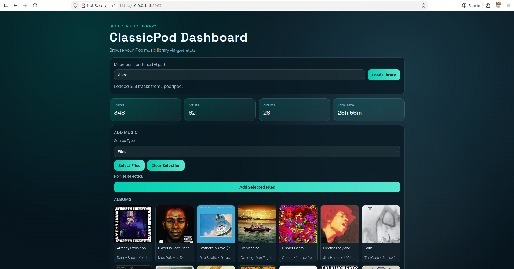

# ClassicPod Dashboard

ClassicPod Dashboard is a Linux web app for browsing and managing music on an iPod Classic.
It is built on top of `gpod-utils` for iPod database read/write operations.

Reference: [Original gpod-utils repository](https://github.com/whatdoineed2do/gpod-utils)

## Screenshot



## Features

- Load iPod library from a mountpoint or direct `iTunesDB` path
- Browse tracks, artists, albums, and album art
- Add music files/folders to the iPod
- Auto-convert FLAC to ALAC during import
- Delete tracks or albums from the iPod

## Run With Docker

1. Mount your iPod on the host.
2. Start the app:

```bash
sudo docker compose down
sudo env IPOD_MOUNTPOINT=/media docker compose up --build -d
```

3. Open `http://localhost:8080`.
4. Use mountpoint `/ipod` in the UI.

Optional custom host IP/port:

```bash
sudo env IPOD_MOUNTPOINT=/media HOST_IP=0.0.0.0 HOST_PORT=8090 APP_PORT=8080 docker compose up --build -d
```

## Run Without Docker (Linux)

1. Install system dependencies:

```bash
sudo apt-get update
sudo apt-get install -y python3 python3-pip ffmpeg git autoconf automake build-essential libtool pkg-config libglib2.0-dev libjson-c-dev libsqlite3-dev libgpod-dev libavcodec-dev libavformat-dev libavutil-dev libswresample-dev libswscale-dev
```

2. Install `gpod-utils` from source:

```bash
git clone --depth 1 https://github.com/whatdoineed2do/gpod-utils /tmp/gpod-utils
cd /tmp/gpod-utils
autoreconf --install
./configure
make -j"$(nproc)"
sudo make install
```

3. Install Python dependencies:

```bash
cd /path/to/classicpod_dashboard
python3 -m pip install -r requirements.txt
```

4. Run the app:

```bash
python3 app.py
```

5. Open `http://localhost:8080` and use your host iPod mountpoint.
